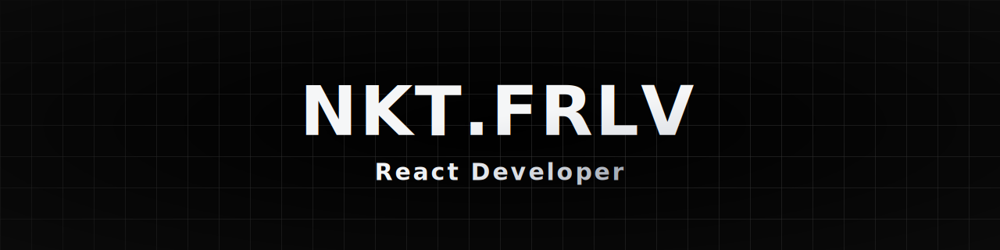

<h3 align="center">Front-End Developer | React | TypeScript | Next.js</h3>

---

I’m a front-end developer focused on building scalable, performant, and user-oriented web applications.  
My background in the hospitality industry helped me develop excellent communication and teamwork skills — qualities I now apply in building clear, maintainable, and collaborative codebases.

- Passionate about **React**, **TypeScript**, and clean architecture principles  
- Experienced in **state management**, **testing**, and **micro-frontend architecture**
- Dedicated to delivering **robust UI** and **smooth user experience**

⚙️ AI & Automation

Building AI-driven features and intelligent developer tools — from conversational agents to adaptive UX systems that extend user interaction and automation capabilities.

---

## 🧠 Tech Stack

## 💡 AI Tech Stack

---

## 🧰 Tools & Platforms

---

  
  
  

---

  

